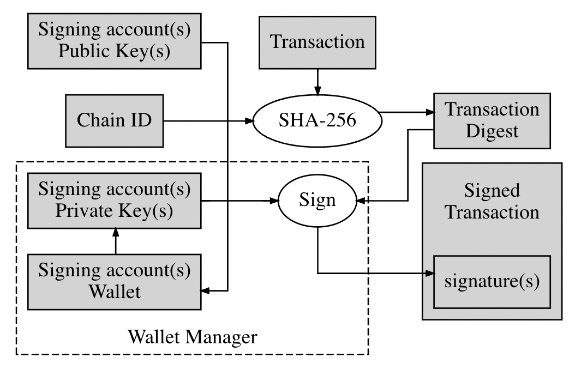

# Mandel 이란?

Mandel 은 블록체인 네트워크를 구축할 수 있는 오픈소스 소프트웨어 입니다. 원래 이 소프트웨어는 EOSIO 라는 이름으로 블록체인 기업인 블록원(Block.one) 에서 개발하고 관리 하였습니다. 그러나 최근 EOS 재단인 ENF(EOS Network Foundation) 가 설립 된 후 이 곳에서 EOSIO 를 포킹(Forking)하여 Mandel 이라는 이름으로 리브랜딩하고 EOSIO 를 만든 개발자들을 데려와 직접 관리하고 있습니다.

ENF 는 다음과 같이 Mandel 을를 소개하고 있습니다.

> Mandel is a free, open-source blockchain software protocol that provides developers and entrepreneurs with a platform on which to build, deploy and run high-performing blockchain applications.
>
> Mandel 은는 무료 오픈 소스 블록체인 소프트웨어 프로토콜이며, 개발자와 기업가가 고성능 블록체인 애플리케이션을 구축, 배포 및 실행 할 수 있는 플랫폼을 제공합니다.

즉 'Mandel' 이라는 오픈 소스 소프트웨어 플랫폼을 기반으로 'EOS' 라는 블록체인 네트워크를 운영하고 토큰(코인)을 발행한다고 생각하면 됩니다. Mandel 의 전신인 EOSIO 는 오픈소스 소프트웨어이기 때문에 EOS 체인뿐만 아니라 WAX, FIO, Proton, Telos 등 여러 퍼블릭 블록체인 네트워크들이 이를 기반으로 자신들의 특색에 맞게 커스터마이징 하여 사용하고 있습니다.&#x20;

Mandel 을 이해하면 Mandel/EOSIO 을 기반으로 하는 다른 블록체인 네트워크에도 쉽게 접근할 수 있습니다. 따라서 Mandel/EOSIO 기반 블록체인에서 스마트 계약 혹을 디앱을 개발하려는 계획을 가지고 있다면 먼저 이 소프트웨어를 이해하고 다루는 방법 부터 시작해야 합니다.

Mandel 이 EOSIO 로 부터 포킹되어 나온지 얼마 되지 않았기 때문에 아직은 두 소프트웨어간의 기본적인 기능 차이는 크지 않은 편 입니다. 그렇다고 해도 EOSIO 는 사실상 개발 중단된 상황이고 Mandel 은 ENF 의 관리 하에 활발하게 개발 및 유지보수가 이루어지고 있기 때문에 본 문서는 Mandel 을 기준으로 작성할 것입니다

### Mandel 의 구성 요소

Mandel/EOSIO 플랫폼은 블록체인 네트워크를 운영하고 스마트 컨트랙트를 개발하는데 필요한 여러가지 주요 컴포넌트와 라이브러리들을 가지고 있습니다.

그 중 가장 중요한 핵심 컴포넌트는 다음과 같습니다.

#### nodeos (node + eos)

nodeos 는 Mandel 코어 데몬이며 각종 설정을 플러그인 방식으로 구성하여 원하는 목적에 맞는 블록체인 노드를 구성하고 운영할 수 있습니다. nodeos 데몬이 정상적으로 동작하면, 설정된 내용에 따라 블록을 생성하거나, 트랜잭션을 처리하거나, API 엔드포인트를 제공하거나, 다른 노드와 블록을 동기화 하는 등의 작업을 수행합니다.

#### keosd (key + eos + daemon)

로컬 환경에서 개인 키를 저장하고 관리하기 위한 키 관리용 데몬입니다. keosd 는 키를 안전하게 암호화하여 지갑 파일에 저장하는, 키 저장용 매개체 역할을 합니다.

#### cleos (cli + eos)

cleos 는 nodeos 가 제공하는 REST API 와 통신하기 위한 커맨드라인 인터페이스 도구입니다. cleos 를 사용하여 nodeos 에 명령을 전달하거나 스마트 컨트랙트를 배포하는 등의 작업을 할 수 있습니다. 또한 cleos 는 nodeos 뿐만 아니라 keosd 와도 통신 하는데 사용할 수 있습니다.

위 3개 컴포넌트는 Mandel/EOSIO 기반 체인을 운영함에 있어 반드시 알아야 할 내용입니다.

추가로 개발에 필요한 다음과 같은 주요 컴포넌트들이 있습니다.

#### CDT

CDT는 WASM(Web Assembly)용 개발 툴킷이자, Mandel/EOSIO 플랫폼 상에서 동작하는 스마트 컨트랙트를 쉽게 작성할 수 있도록 도와주는 도구들을 모은 것입니다. CDT 는 범용 Web Assembly 개발 도구일 뿐만 아니라 Mandel/EOSIO 스마트 컨트랙트를을 개발 할 때 Mandel 에 최적화 된 기능을 사용할 수 있습니다. CDT 는 Clang 9을 기반으로 만들어졌으며, 최신의 LLVM 최적화 도구 및 분석 도구를 다수 포함하고 있습니다.

#### EOSJS

Mandel 에서 제공하는 RPC API를 사용하여 블록체인 네트워크와 상호작용하는 프론트엔드 Javascript API SDK입니다.

지금까지 알아본 컴포넌트들의 관계를 그림으로 나타내면 다음과 같습니다.

Mandel 에 대한 핵심 내용은 앞으로 이어질 포스팅에서 다룰 예정이지만 보다 자세한 내용이 필요하시면 EOSIO Developer Portal 에서 찾아볼 수 있습니다.
